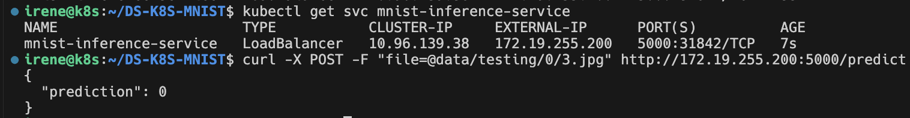

# Training & Inference in K8S
## Prerequisites
- docker
- kubectl
- a K8S cluster
    - You can simply create one using [kind](https://kind.sigs.k8s.io/).
- set up LoadBalancer
    - You can use LoadBalancer in kind cluster by [MetalLB](https://kind.sigs.k8s.io/docs/user/loadbalancer/).

## Training
The code is mainly refer to [PyTorch Examples](https://github.com/pytorch/examples/tree/main/mnist).
- build the image & load it into the K8S cluster
    ```
    cd training
    docker build -t mnist:train .
    kind load mnist:train
    ```
- deploy the pod
    ```
    kubectl create -f train-pod.yaml
    ```
- if you want to run the pod on the specific node, for example, the node with label `training=allowed`
    ```
    kubectl label nodes kind-worker training=allowed
    kubectl create -f train-pod-affinity.yaml
    ```
- - if you want to save the model
    ```
    kubectl create -f train-pod-affinity-mount.yaml
    ```

## Inference
We are going to deploy a Python Flask server running the MNIST Inference in K8S.
- build the image & load it into the K8S cluster
    ```
    cd inference
    docker build -t mnist:inference
    kind load mnist:inference
    ```
- deploy in K8S
    ```
    kubectl create -f inference.yaml
    ```
- get the external IP of the service
    ```
    kubectl get svc mnist-inference-service
    ```
- send a request to the server
    ```
    curl -X POST -F "file=@<image_path>" http://<externel_ip>:5000/predict
    ```
    
